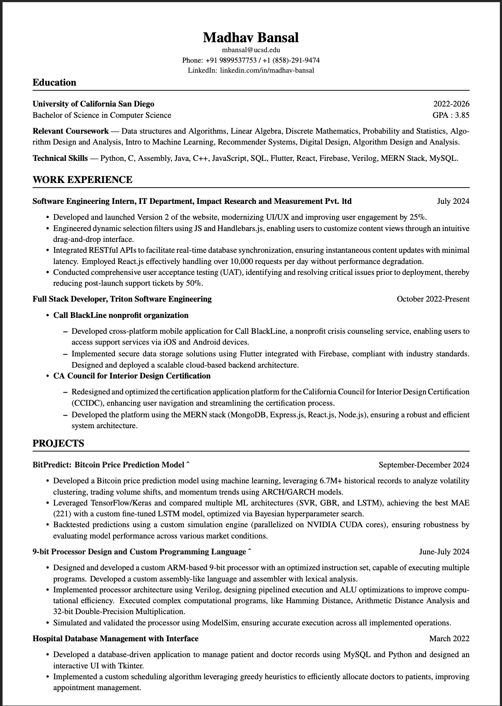

# Madhav Bansal

## About Me

Hi! I'm **Madhav Bansal**, a Computer Science undergraduate at _University of California, San Diego_ (Class of 2026), passionate about building scalable systems and exploring the world of AI and systems architecture.

## Skills

- Programming Languages: Python, Java, C++, JavaScript, Assembly, Verilog
- Web Development: MERN Stack, React, Firebase, Flutter
- Tools & Frameworks: TensorFlow, Keras, MySQL, SQL
- Others: REST APIs, UAT, CUDA, ModelSim

## Work Experience

### Software Engineering Intern — _Impact Research and Measurement Pvt. Ltd._ (July 2024)

- Revamped UI/UX, increasing user engagement by **25%**.
- Built dynamic drag-and-drop filters using `JavaScript` & `Handlebars.js`.
- Integrated REST APIs with `React.js`, handling 10k+ requests/day.
- Reduced post-launch issues by **50%** via User Acceptance Testing.

### Full Stack Developer — _Triton Software Engineering_ (Oct 2022 – Present)

#### Call BlackLine

- Built a cross-platform mobile app for a nonprofit.
- Integrated secure cloud backend with Flutter & Firebase.

#### CA Council for Interior Design Certification (CCIDC)

- Rebuilt the certification platform using the MERN stack.
- Enhanced navigation and efficiency for thousands of users.

## Projects

### [BitPredict: Bitcoin Price Prediction](https://github.com/Madhav182003/Bit-Predict.git)

- Processed 6.7M+ records using ML (LSTM, SVR, GBR).
- Achieved best MAE (221) with custom-tuned `LSTM`.
- CUDA-powered backtesting for robustness.

### [9-bit Processor Design](https://github.com/Madhav182003/9-bit-Processor-Design.git)

- Designed a 9-bit processor & custom language.
- Built ALU with pipelining in Verilog.
- Simulated and validated operations via ModelSim.

### Hospital Management DB Interface

- Built a MySQL + Tkinter-based hospital database.
- Used greedy scheduling to improve appointments.

## Education

### University of California, San Diego (2022–2026)

**Bachelor of Science in Computer Science**  
GPA: _3.85_

**Relevant Courses**:

- Data Structures and Algorithms
- Machine Learning
- Algorithm Design
- Probability and Stats
- Digital Design

## Links

- [LinkedIn](https://www.linkedin.com/in/madhav-bansal)
- [GitHub](https://github.com/Madhav182003)

## Section Links

Jump to [Skills](#-skills) or [Projects](#-projects)

## Ordered List: How I Approach a Project

1. Understand the problem
2. Design a scalable architecture
3. Write clean, modular code
4. Test extensively
5. Iterate based on feedback

## Task List

- [x] Upload `index.md`
- [x] Include picture and all required Markdown elements
- [x] Push to GitHub repo
